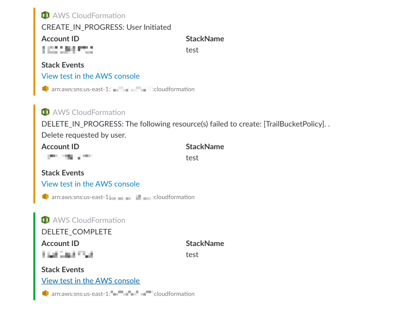

# CFNotify, a CloudFormation Notifier

## What?
An AWS Lambda function that will post CloudFormation status updates to a Slack channel via a Slack Web Hook.

This was originally forked from https://github.com/guardian/cf-notify.

## Why?
To give visibility of CloudFormation changes to the whole team in a quick and simple manner. For example:

## Usage

Simply run `make deploy` from the root of the working copy.

Once setup is complete, all you need to do is set the notification ARN when you update any CloudFormation stack:

    STACK_NAME=MyStackName
    SNS_ARN=$(aws cloudformation list-exports --query "Exports[?Name==\`${STACK_NAME}\`].Value" --output text)
    aws cloudformation [create-stack|update-stack|delete-stack] --notification-arns $(SNS_ARN)

You should now see messages in Slack!
